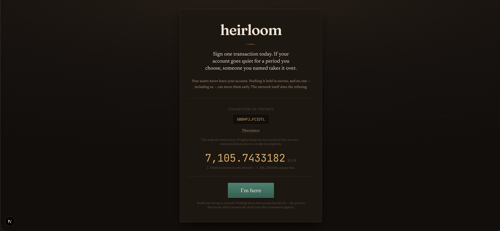
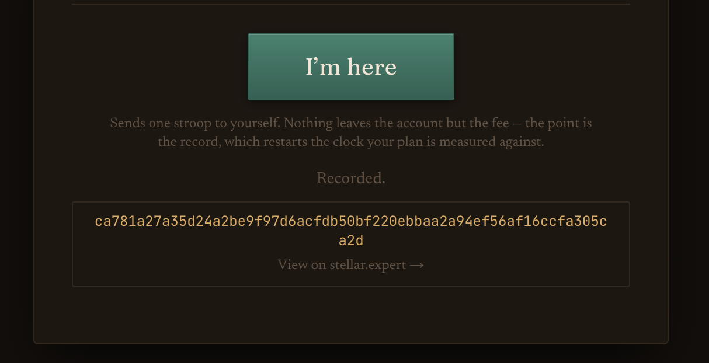
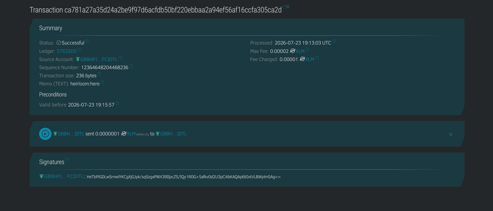

# heirloom

**A dead man's switch for Stellar.**

heirloom lets you sign one transaction today so that, if your account ever goes
quiet for a period you choose, someone you named takes it over. Your assets never
leave your account — nothing is held in escrow, no one including the app can move
them early, and the Stellar network itself does the refusing. The heir can even
be *future you*: lose your keys, the account goes idle on its own, and a fresh
wallet you set aside takes over.

**Live demo:** [stellar-heirloom.vercel.app](https://stellar-heirloom.vercel.app)

Built level-by-level for the **Stellar Builder Challenge**. One repository, one
product — each belt adds a section here, and earlier levels stay in place as the
README grows.

## Level 1 — White Belt

The foundation: connect a Freighter wallet on testnet, read and show the balance,
and send a real transaction with clear feedback. In heirloom that transaction is
the **heartbeat** — a one-stroop payment to yourself that proves you are still
here and restarts the idle clock any future plan is measured against. Nothing
leaves the account but the fee; the point is the on-chain record.

### Features

- **Freighter connection** on testnet, with a live network-mismatch check so you
  can't read a testnet balance while signing on mainnet.
- **Disconnect and silent reconnect** — a returning visitor is restored without
  clicking through the extension again, trusting only Freighter's own record.
- **Balance with reserve breakdown**, so what is actually spendable is never
  confused with the total held against the account's minimum reserve.
- **Friendbot funding** for a brand-new account, in one click.
- **The heartbeat transaction** — a self-payment that lands on-chain and returns
  the hash, with a link out to the explorer.
- **Typed error handling** across every step: wallet missing, wrong network,
  declined signature, insufficient funds, or a failed read you can retry.

### Screenshots

| Connected wallet & balance | Transaction result | Confirmed on-chain |
| --- | --- | --- |
|  |  |  |

## Tech stack

- **[Next.js](https://nextjs.org)** (App Router) + **TypeScript** — hand-written
  CSS, no UI framework, so the interface carries its own chest-and-brass character.
- **[@stellar/stellar-sdk](https://github.com/stellar/js-stellar-sdk)** — builds
  and submits transactions against Horizon.
- **[@stellar/freighter-api](https://github.com/stellar/freighter-api)** — wallet
  connection and signing.

## Getting started

### Prerequisites

- [ ] Node.js 20 or newer
- [ ] The [Freighter](https://www.freighter.app/) extension, set to **Testnet**
      (Freighter → settings → Network → Test Net)

### Run the web app

```bash
git clone https://github.com/<your-account>/stellar-heirloom.git
cd stellar-heirloom
npm install
npm run dev
```

Open <http://localhost:3000>, connect Freighter, and — if the account is new —
click **Fund with test XLM** to have the friendbot faucet create it. Then press
**I'm here** to send the heartbeat.

heirloom runs on testnet with no configuration. Two optional variables repoint it:

| Variable | Default | Purpose |
| --- | --- | --- |
| `NEXT_PUBLIC_STELLAR_NETWORK` | `testnet` | `testnet` or `mainnet`. |
| `NEXT_PUBLIC_HORIZON_URL` | network default | Override the Horizon endpoint. |

## Testing

The dead man's switch itself is verified against live testnet:

```bash
npm run verify:preconditions
```

This arms throwaway testnet accounts and proves, with real transactions, that a
takeover is refused while an account is active and accepted only once it has gone
idle — for both the standing (survives activity) and sealed (one-shot) plan
modes. Ten checks, all passing. It becomes the CI suite at a later belt.

## Network

Testnet only. The arming and cancellation paths are the two places where a bug
would cost someone their account, so mainnet stays locked until those have been
reviewed end to end.

## Roadmap

- **L1 — White Belt:** wallet, balance, heartbeat transaction ✓
- **Next:** an heir registry and the precondition engine that arms and cancels a
  real plan — added here as each belt lands.
