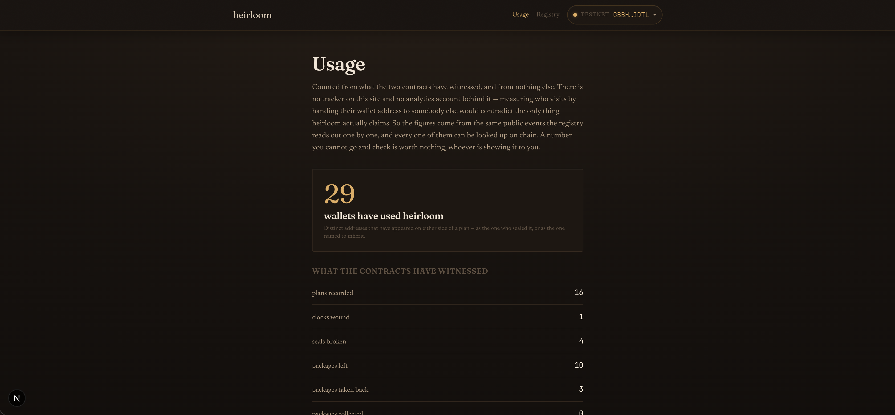
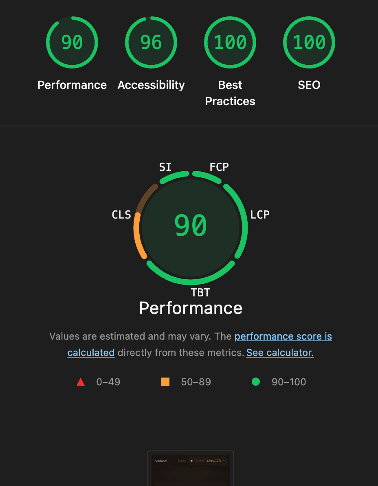
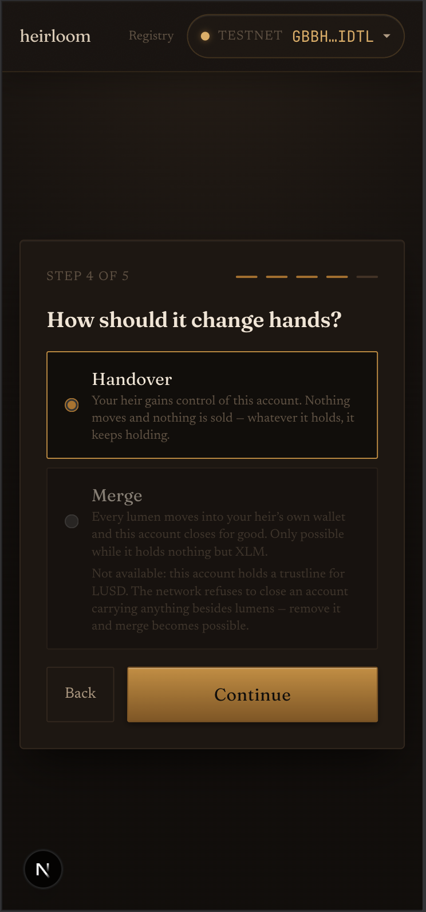
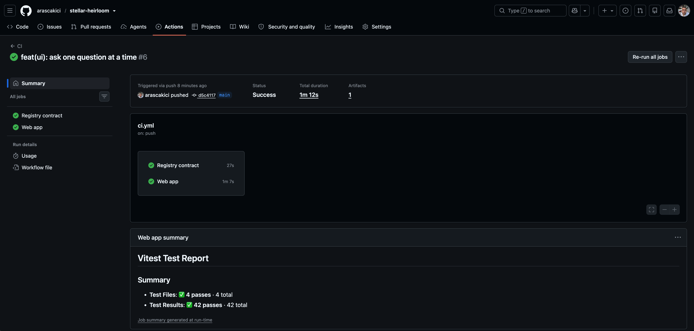
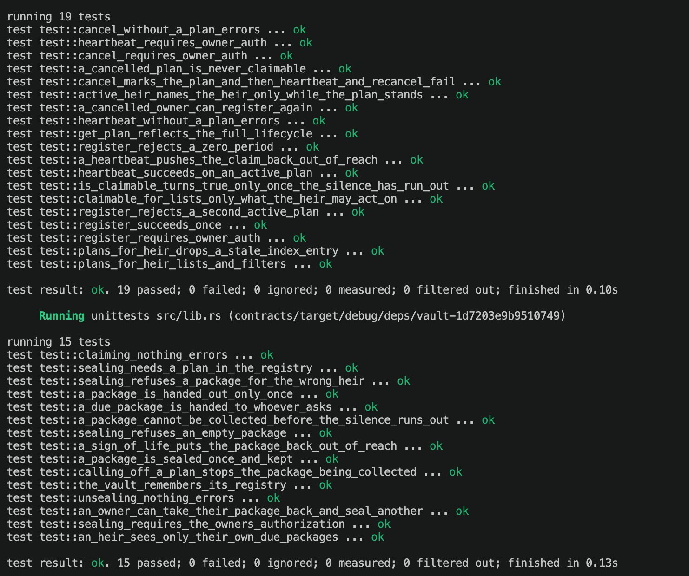
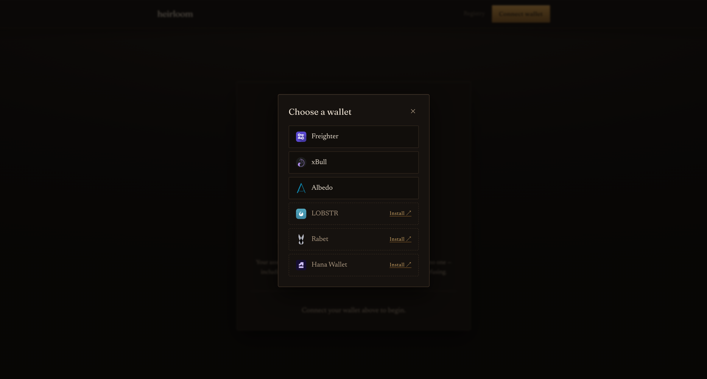
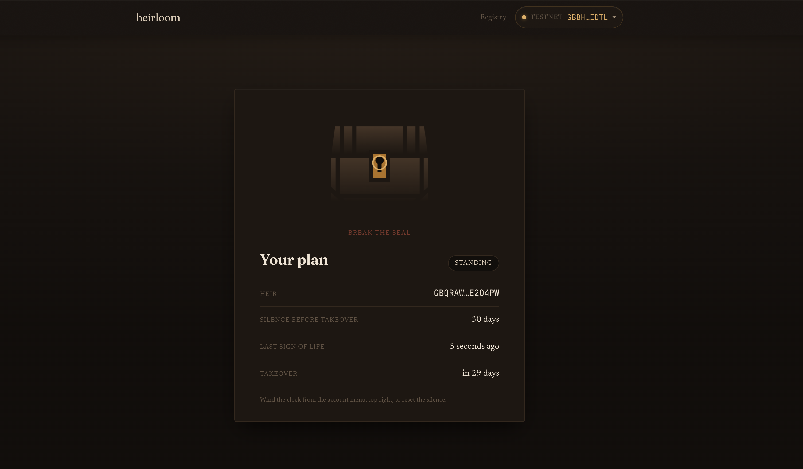
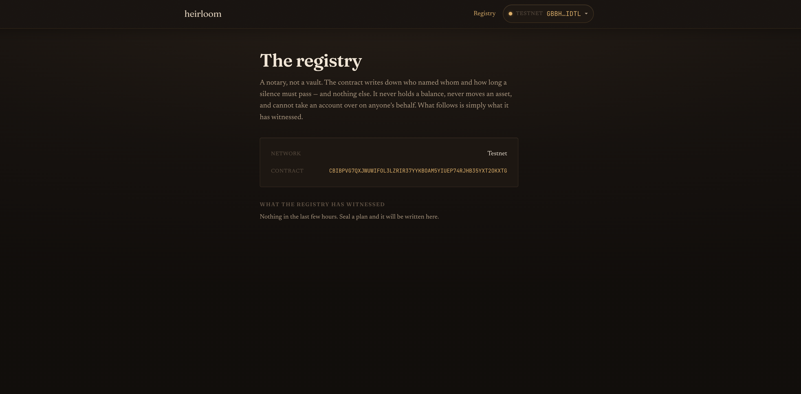
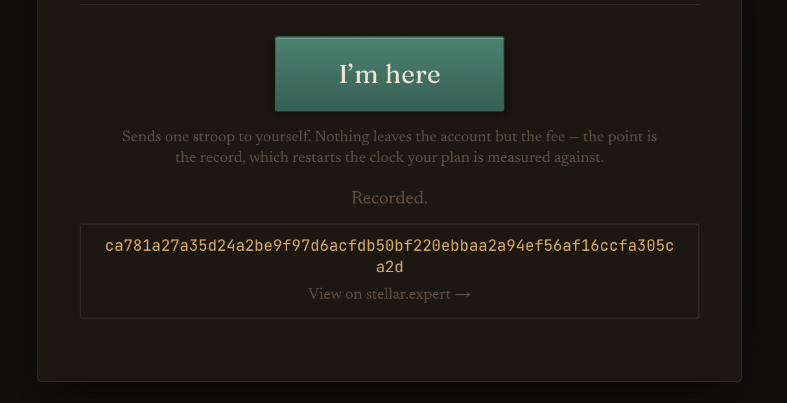
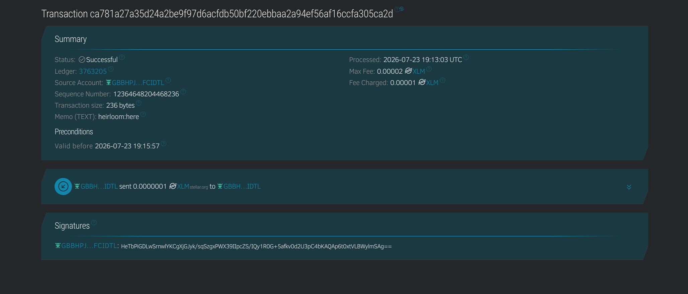

# heirloom

[](https://github.com/arascakici/stellar-heirloom/actions/workflows/ci.yml)

**A dead man's switch for Stellar.**

heirloom lets you sign one transaction today so that, if your account ever goes
quiet for a period you choose, someone you named takes it over. Your assets never
leave your account — nothing is held in escrow, no one including the app can move
them early, and the Stellar network itself does the refusing. The heir can even
be *future you*: lose your keys, the account goes idle on its own, and a fresh
wallet you set aside takes over.

**Live demo:** [stellar-heirloom.vercel.app](https://stellar-heirloom.vercel.app)

Built level-by-level for the **Stellar Builder Challenge**. One repository, one
product — each belt adds a section here, and earlier levels stay in place as the
README grows.

## Level 4 — Green Belt

The product stops being a demo. Everything that was true on paper at Level 3 —
that a package waits, that anybody can deliver it, that nothing needs trusting —
got measured, and two of those claims turned out to be false in practice. Both
were silent. Neither would have surfaced without going looking.

**The watchtower had never been able to work.** It found packages by watching
`Sealed` events go past, and Soroban RPC keeps events for about a week — while a
package is written precisely so it can wait for months. By the time a silence
ran out, the announcement was long gone. It never errored; it found an empty list
every hour, which is indistinguishable from having nothing to do. A package
sealed on 26 July was already due and already invisible. The vault now keeps a
list of what it holds and answers `owners()`, so there is no window to fall
outside of — and a redeploy that fixed a second bug at the same time, a stale
contract address in the script that had gone unnoticed since the previous
deployment. Both are now pinned by a test that fails CI if the two ever disagree.

**And the job could not report failure.** It exited zero whatever happened, so
the one process whose silence looks exactly like success could never say
otherwise. A refusal is still news rather than a failure — the owner moved,
which is the mechanism working — but a package that was due and did not go out
now turns the run red.

| | registry | vault |
| --- | --- | --- |
| **Contract** | [`CDWSKU743CENKIALSGUJRBUAAN5B5SBQG37XX2FSQO6XEXWXJA6VBEQU`](https://stellar.expert/explorer/testnet/contract/CDWSKU743CENKIALSGUJRBUAAN5B5SBQG37XX2FSQO6XEXWXJA6VBEQU) | [`CANLQE764X2GHPCFHHDIBXPT35PATT2IIYRCFBK77O6EECKS3CPJDHPY`](https://stellar.expert/explorer/testnet/contract/CANLQE764X2GHPCFHHDIBXPT35PATT2IIYRCFBK77O6EECKS3CPJDHPY) |

### What this level added

- **[`/usage`](https://stellar-heirloom.vercel.app/usage) — usage counted from
  the chain, with no tracker anywhere.** Measuring visitors by handing their
  wallet addresses to a third party would contradict the only thing heirloom
  claims. Every figure comes from the contracts' own events and every one can be
  looked up. Because RPC forgets after a week, the record over all time lives in
  the repository, in git, where each addition is dated and checkable.
- **Feedback asked for in heirloom's own voice**, posted behind the scenes to a
  form. A browser cannot post to Google Forms and read what came back, so the
  one server route in the project makes the hop and reports something true
  instead of guessing.
- **Failures written down without writing down the person.** Account ids,
  contract ids, hashes, envelopes and emails are stripped twice — once where the
  error is caught and once on the server that records it, because that route is
  reachable by anyone. A secret seed gets a placeholder loud enough that the log
  is unreadable past it. Fifteen tests hold the line, against real generated
  keys rather than strings that look like them.
- **Measured before optimised.** The obvious suspect was the bundle; it turned
  out blocking time was already zero, and shrinking the SDK would have been a
  week for nothing. What the numbers pointed at instead was 200 KB of preloaded
  fonts including a subset for glyphs no page renders, and a top bar that
  resized on hydration and moved every page four pixels. Mobile 72–81 → 91–92,
  layout shift to **zero**, desktop **100**.
- **Contract cost, and where it runs out.** Sealing a plan costs 0.065 XLM and
  keeping it alive 0.0018 XLM a time. Nothing was worth optimising — the largest
  thing stored is the signed takeover itself, which is the product. What the
  measurement did find is a ceiling: 44 bytes per owner, measured by sealing
  five plans and watching the slope, against a 65,536-byte entry limit. The
  vault fills at about 1,489 packages, and fails as a closed door rather than a
  locked one.

### Verified on chain

| Claim | How it was shown |
| --- | --- |
| Empty ledger bounds change nothing | a takeover carrying them is still refused early for the silence (`tx_bad_minseq_age_or_gap`), and still lands once due ([`6993bf79…`](https://stellar.expert/explorer/testnet/tx/6993bf79412cb870404f901c0ce1f0c86996aa570b516cea3190984f29ec75e0)) |
| The vault knows what it holds | empty list, one seal, two seals, then an unseal removing the right one and leaving the other |
| A courier needs no history | watchtower found and delivered a package whose `Sealed` event was long outside the event window — `2 waiting · 2 due · 1 delivered` where the old code found none ([`963443da…`](https://stellar.expert/explorer/testnet/tx/963443dae5bdf7246285b45c58cff271c92756b9e6fef58ee8d261a7383866ce)) |
| Joint delivery leaves nobody locked out | both keys at weight 1 against thresholds of 1, after a real takeover |
| Costs are what the README says | simulated against the live network by `npm run costs`, which anybody can run again |

### Screenshots

| Usage, counted from the chain | Measured, not assumed |
| --- | --- |
|  |  |

### Demo

<!-- TODO: link the walkthrough video. -->

## Level 3 — Orange Belt

The plan learns to arrive. Until now heirloom could record who inherits what and
refuse a takeover that came too early — but somebody still had to be holding the
signed transaction when the silence finally ran out. Now the transaction lives on
chain, in the open, in a second contract that asks the first whether the wait is
over.

Storing it publicly is the point rather than a compromise. The chain refuses the
transaction until the account has truly gone quiet, so a package anybody can read
is a package nobody can misuse — and once it *is* due, anybody at all can be the
courier. The heir does not have to be watching. Nor does anyone else.

| | registry | vault |
| --- | --- | --- |
| **Contract** | [`CDWSKU743CENKIALSGUJRBUAAN5B5SBQG37XX2FSQO6XEXWXJA6VBEQU`](https://stellar.expert/explorer/testnet/contract/CDWSKU743CENKIALSGUJRBUAAN5B5SBQG37XX2FSQO6XEXWXJA6VBEQU) | [`CANLQE764X2GHPCFHHDIBXPT35PATT2IIYRCFBK77O6EECKS3CPJDHPY`](https://stellar.expert/explorer/testnet/contract/CANLQE764X2GHPCFHHDIBXPT35PATT2IIYRCFBK77O6EECKS3CPJDHPY) |
| **Deploy tx** | [`399e9ae4…`](https://stellar.expert/explorer/testnet/tx/399e9ae4119e16c39859b8505081853b1fcda7d655bf4485cce2877e6c88b684) | [`a28d7173…`](https://stellar.expert/explorer/testnet/tx/a28d7173fc4b2837a1de41b608e44ef6c05235f6fc12b1546b02019f54cc0aef) |
| **A package collected** | — | [`28e66b92…`](https://stellar.expert/explorer/testnet/tx/28e66b92dff988a1777c8897f9eeb3a7af07f9460faef6a4913e2636fe321c66) |

### Features

- **A second contract, and a real conversation between them.** The vault holds
  the package; the registry holds the record. When a package is sealed the vault
  asks the registry who the heir is, and refuses a package that names anyone
  else. When one is claimed it asks whether the silence has run out. The rule
  lives in one place, so the two can never disagree about when a takeover became
  due.
- **The interface is declared, not imported** — `#[contractclient]` on a trait,
  so the registry's implementation never reaches the vault's wasm. Confirmed:
  `stellar contract info interface` lists the vault's seven functions and none of
  the registry's. The tests wire the two together for real, so the cross-contract
  call is exercised rather than mocked.
- **Three ways for an account to change hands**, chosen when the plan is sealed.
  *Joint* adds the heir alongside you and leaves your own key working, so a
  silence you never meant cannot lock you out of your own account — the default,
  and the right one when the heir is a spare wallet of your own. *Handover*
  stands your key down instead, which is what you want if it might one day be
  found by somebody else. *Merge* sends every lumen into the heir's own wallet
  and closes the account; it is offered only to accounts that can take it, since
  one trustline is enough for the network to refuse.
- **And a way back.** Plans fire for reasons nobody meant: an illness, a long
  trip, a forgotten month. After a handover the owner cannot undo it, because
  their key no longer signs for anything — so the heir can, in one operation
  that returns the key and gives up their own access. It is the takeover run in
  reverse, and it is the heir's to offer, which is the trust they were named
  for.
- **And a way to finish.** A handover gives the heir control, not possession —
  the balances stay where they were. So the app carries on: it reads what is
  actually in the account, moves it home, and where nothing is left behind
  closes the old account so even its locked reserve comes back. A pre-signed
  transaction could never do this, because it cannot know a future balance.
- **An heir's side of the app.** Connect a wallet and see the accounts that named
  you — and, among them, the ones that have gone quiet long enough to be yours.
  Which is which is the contract's answer, not a sum the page does. Taking one
  over submits a transaction the heir never built, never signed, and could not
  alter.
- **One book for both contracts.** `/registry` polls Soroban RPC for the
  registry *and* the vault in a single filter and writes the six events out as
  sentences — a plan recorded, a clock wound, a seal broken, a package left,
  taken back, or collected. A collection gets the only mark on the page that
  cannot be undone.
- **A watchtower that holds no keys.** An hourly job walks the vault and carries
  anything due to the network. Delivering a signed transaction needs no
  signature, so it cannot act early and cannot be trusted wrongly — and if it
  stops running, an heir loses nothing but the convenience.
- **CI on every push** — formatting, clippy, 39 contract tests, a `wasm32v1-none`
  build, then lint, 91 frontend tests and a production build. Deployment is a
  separate workflow that runs only by hand, only after a typed confirmation, and
  installs a checksum-pinned toolchain before it is shown a key.
- **Three signatures, said out loud.** Sealing records the plan, signs the
  takeover, and stores it — Stellar allows one contract call per transaction, so
  they cannot be folded together. The form says so rather than springing three
  wallet prompts on someone expecting one.

### Verified on chain

Every rule this level added was proven against live testnet before it was
believed, not read from documentation:

| Claim | How it was shown |
| --- | --- |
| A pre-signed `AccountMerge` honours `minSeqAge` | refused while active, accepted after the silence, every lumen landing in the heir's wallet |
| A merge cannot close an account with subentries | one trustline → `tx_failed` / `op_has_sub_entries` |
| The vault really does ask the registry | `seal` succeeds only against a plan the registry confirms |
| A package is refused before its time | `Error(Contract, #6)` — `NotYet` |
| **A sealed plan survives being stored** | the subtle one: a sealed takeover claims the *next* sequence number, and storing it spends one. Built naively it would void itself on the spot. Built against the sequence the account will be on afterwards, it lands ([`d98711c0…`](https://stellar.expert/explorer/testnet/tx/d98711c06042d1ccaaff141ff54ac4ca7c882a5d1c0a4c2fc1259e0a2deebf74)) |

### Screenshots

| Mobile | The pipeline | The contract tests |
| --- | --- | --- |
|  |  |  |

## Level 2 — Yellow Belt

The plan goes on chain. A Soroban contract written in Rust keeps the **record** —
who named whom, after how long a silence, in which mode — and nothing else. It
never holds a balance, never moves an asset, and cannot take an account over on
anyone's behalf; the takeover itself stays a precondition transaction the network
enforces. A notary, not a vault. Alongside it the wallet stops being Freighter
alone, and the interface finds its object: a chest that closes over a plan when
you seal it.

| | |
| --- | --- |
| **Contract** | [`CBIBPVG7QXJWUWIFOL3LZRIR37YYKBOAM5YIUEP74RJHB35YXT2OKXTG`](https://stellar.expert/explorer/testnet/contract/CBIBPVG7QXJWUWIFOL3LZRIR37YYKBOAM5YIUEP74RJHB35YXT2OKXTG) |
| **Network** | Testnet |
| **Sample `register` call** | [`f8121bbe…`](https://stellar.expert/explorer/testnet/tx/f8121bbe5e06e0d96ac6b84728109a23c7236541d06e3fdf16aaca23c6a9ebfd) |

The contract's interface, storage and events are documented in
[`contracts/README.md`](contracts/README.md); every deployment fact — wasm hash,
upload and create hashes, redeploy steps — in
[`contracts/deployments.md`](contracts/deployments.md).

> The registry was redeployed at Level 3 to add the reads the vault needs, so
> the app now talks to a newer address. The one above is what Level 2 shipped
> and is still on chain, holding everything it witnessed.

### Features

- **The registry contract** — `register`, `heartbeat` and `cancel` behind the
  owner's `require_auth`, plus `get_plan` and `plans_for_heir` as free reads, so
  an heir can discover a plan without being told about it.
- **Two plan modes, recorded on chain** — *standing* survives ordinary activity
  and is called off deliberately; *sealed* is one-shot, and any transaction at
  all voids it.
- **Events with indexed topics** — `Registered`, `Heartbeat` and `Cancelled`,
  keyed on owner and heir, so a watcher can subscribe to exactly the plans that
  name them.
- **Typed contract errors** — `PlanExists`, `InvalidPeriod`, `NoPlan` and
  `NotActive` come back through the frontend as sentences, never as a raw code.
- **Six wallets, one door** — Freighter, xBull, Albedo, LOBSTR, Rabet and Hana
  through StellarWalletsKit, with the picker drawn in heirloom's own brass
  rather than the kit's default modal; uninstalled wallets offer a way to get one.
- **The chest** — sealing a plan draws the lid down over the form until the
  words are enclosed; calling it off breaks the lock, and the chest comes
  forward and opens to give the choices back.
- **A plan dashboard** — heir, silence, last sign of life and a live countdown
  to takeover, plus the plans that name *you* as heir.
- **A live registry page** — what the contract has witnessed, polled from
  Soroban RPC `getEvents` and written out as sentences; your own account's
  doings refresh the plan in place.
- **14 contract unit tests**, covering both modes, every error, and the
  heir-discovery index.

### Screenshots

| Choosing a wallet | A sealed plan | The registry |
| --- | --- | --- |
|  |  |  |

## Level 1 — White Belt

The foundation: connect a Freighter wallet on testnet, read and show the balance,
and send a real transaction with clear feedback. In heirloom that transaction is
the **heartbeat** — a one-stroop payment to yourself that proves you are still
here and restarts the idle clock any future plan is measured against. Nothing
leaves the account but the fee; the point is the on-chain record.

### Features

- **Freighter connection** on testnet, with a live network-mismatch check so you
  can't read a testnet balance while signing on mainnet.
- **Disconnect and silent reconnect** — a returning visitor is restored without
  clicking through the extension again, trusting only Freighter's own record.
- **Balance with reserve breakdown**, so what is actually spendable is never
  confused with the total held against the account's minimum reserve.
- **Friendbot funding** for a brand-new account, in one click.
- **The heartbeat transaction** — a self-payment that lands on-chain and returns
  the hash, with a link out to the explorer.
- **Typed error handling** across every step: wallet missing, wrong network,
  declined signature, insufficient funds, or a failed read you can retry.

### Screenshots

| Connected wallet & balance | Transaction result | Confirmed on-chain |
| --- | --- | --- |
|  |  |  |

## Tech stack

- **[Next.js](https://nextjs.org)** (App Router) + **TypeScript** — hand-written
  CSS, no UI framework, so the interface carries its own chest-and-brass character.
- **[@stellar/stellar-sdk](https://github.com/stellar/js-stellar-sdk)** — builds
  and submits transactions against Horizon, and calls the contract over Soroban RPC.
- **[stellar-wallets-kit](https://github.com/Creit-Tech/Stellar-Wallets-Kit)** —
  six wallets behind one interface; heirloom draws the picker itself.
- **[soroban-sdk](https://github.com/stellar/rs-soroban-sdk)** (Rust) — the
  registry contract, built to `wasm32v1-none`.

## Getting started

### Prerequisites

- [ ] Node.js 22 or newer — `@stellar/stellar-sdk` 16 requires it, whatever
      Next.js alone would settle for
- [ ] A Stellar wallet set to **Testnet** — [Freighter](https://www.freighter.app/),
      xBull, Albedo, LOBSTR, Rabet or Hana. In Freighter that is
      settings → Network → Test Net.
- [ ] Only to rebuild the contract: [Rust](https://rustup.rs) with the
      `wasm32v1-none` target and the
      [Stellar CLI](https://developers.stellar.org/docs/tools/developer-tools/cli/stellar-cli)
      27 or newer. The web app talks to the already-deployed contract, so this
      is optional.

### Run the web app

```bash
git clone https://github.com/arascakici/stellar-heirloom.git
cd stellar-heirloom
npm install
npm run dev
```

Open <http://localhost:3000>, connect a wallet, and — if the account is new —
click **Fund with test XLM** to have the friendbot faucet create it. Then name an
heir and seal the plan; **I'm here**, in the account menu, winds the clock back.

heirloom runs on testnet with no configuration. Five optional variables repoint it:

| Variable | Default | Purpose |
| --- | --- | --- |
| `NEXT_PUBLIC_STELLAR_NETWORK` | `testnet` | `testnet` or `mainnet`. |
| `NEXT_PUBLIC_HORIZON_URL` | network default | Override the Horizon endpoint. |
| `NEXT_PUBLIC_SOROBAN_RPC_URL` | network default | Override the Soroban RPC endpoint. |
| `NEXT_PUBLIC_REGISTRY_ID` | the deployed registry | Point at your own deployment of the record. |
| `NEXT_PUBLIC_VAULT_ID` | the deployed vault | Point at your own deployment of the vault. |

### Feedback

One folded line under the plate, on both pages. Opened, it is a short form —
how useful this is, what should change, and which wallet you tried it with —
answered in place rather than on a page somewhere else. The answers land in a
Google Form's responses, which is where they are read; only the filling in
happens here, because handing someone a white Google panel in the middle of a
dark room tells them they have left the product.

The address is required. Feedback that cannot be placed against a plan on the
ledger is only an opinion, and this way a sentence about the sealing step can be
read next to the sealing that person actually did. When a wallet is connected it
is filled in rather than retyped — nobody transcribes fifty-six characters of
base32 correctly — but it sits in a field you can edit or empty, not carried
along out of sight. That the address travels at all is a deliberate exception to
how the rest of this works, and it is worth naming as one: nothing else in
heirloom asks you to identify yourself, and the count of wallets that have used
it does not depend on the form. That is on chain, where anyone can count it
without being shown a dashboard.

`POST /api/feedback` is the only server route in the project. Not for secrecy —
the form takes anonymous answers and holds no key — but because a browser cannot
post to Google Forms and read what came back. The request is cross-origin, so it
is either refused outright or sent opaquely, where success and failure look
identical. Telling someone their note was received without knowing would be worse
than not asking. The route reads the status and says something true. It also
re-checks everything, since it is reachable by anyone who can send a POST.

## Testing

The contracts are covered by unit tests — both plan modes, every error case, the
heir-discovery index, and the vault wired to a real registry so the
cross-contract call is exercised rather than mocked:

```bash
cargo test --manifest-path contracts/Cargo.toml
```

Thirty-nine checks, all passing.

The frontend's chain logic is covered by Vitest — how a takeover transaction is
built for each mode and delivery, how a period is phrased, and how the
registry's events decode:

```bash
npm test          # once
npm run test:watch
```

Ninety-one checks. The event tests rebuild genuine `ScVal`s rather than
mocking the decoder's input, so a change in how the contract publishes would
fail them rather than slip past.

The dead man's switch itself is verified against live testnet:

```bash
npm run verify:preconditions
```

This arms throwaway testnet accounts and proves, with real transactions, that a
takeover is refused while an account is active and accepted only once it has gone
idle — for both the standing (survives activity) and sealed (one-shot) plan
modes. Ten checks, all passing. It becomes the CI suite at a later belt.

## Usage

[`/usage`](https://stellar-heirloom.vercel.app/usage) counts what the two
contracts have witnessed. There is no tracker on this site and no analytics
account behind it: measuring visitors by handing their wallet addresses to a
third party would contradict the only thing heirloom claims. The figures come
from the same public events the registry reads out one by one, and every id
behind them can be looked up on chain — a number you cannot go and check is
worth nothing, whoever is showing it to you.

Two sources answer two different questions. Soroban RPC keeps events for about
seven days, which is fine for a live feed and useless for a count, so the record
over all time lives in `src/data/usage.json`, in git, where every addition is
dated and anybody can verify it against the chain. The page renders that
immediately and then folds in whatever has happened since.

```bash
npm run usage:snapshot
```

Merges anything new into the record. It only ever grows, dedupes by the event's
RPC id, and is safe to run twice.

The headline figure is distinct addresses that have appeared on either side of a
plan — the one who sealed it, or the one named to inherit. No address is treated
differently from any other: this is testnet, where a key costs nothing, and what
the page is for is what the contracts have actually been put through.

## Performance

Measured before anything was touched, which is the only reason the right thing
got fixed. The obvious suspect was the bundle — the Stellar SDK is large and
reaches every route through the wallet providers in the root layout. It turned
out not to matter: total blocking time was already 0 ms, because every page is
prerendered static HTML and the first paint never waits for JavaScript.
Shrinking the SDK would have been a week of careful work for nothing.

What the numbers actually pointed at, on a throttled mobile profile:

| | before | after |
| --- | --- | --- |
| Home | 78 | **92** |
| Registry | 72 | **91** |
| Usage | 81 | **91** |
| Largest paint | 3.9–4.5 s | 3.3–3.5 s |
| Layout shift | 0.158–0.23 | **0** |

Desktop went 97 → 100, with layout shift likewise to zero.

**Fonts, 200 KB down to 92 KB.** Five files were preloaded on every page. Two of
them existed for `latin-ext` — glyphs no page has ever rendered, since the
interface is English and everything the chain writes is base32 or hex. A third
was the monospace face, preloaded ahead of addresses and hashes that do not
appear until a wallet is connected, competing for bandwidth with the two faces
actually on screen. The largest paint is a paragraph of body text, and it was
waiting on all of it.

**Layout shift, 0.158 to zero, and it was in the top bar.** The wallet's slot
rendered as an empty box on the server — because whether somebody is connected
is not knowable there — and became a button on hydration, taking the bar from
54px wide to 199px and pushing every page down four pixels. The fix is the
button itself, rendered invisible, holding its own footprint open. Standing in
for a thing with a copy of that thing means the reservation cannot drift out of
step with it.

**And the record's ruled lines.** The registry's "Reading the record…" was a
single line that the arriving entries shoved aside — the last shift left, 0.072
of it. It now waits as six ruled lines in the shape of entries, which reserves
the right space and reads better than a sentence about waiting.

One trade-off left deliberately: fonts still use `display: swap` rather than
`optional`. On a slow first visit that costs about a second of largest paint,
and `optional` would buy it back by never swapping the face in at all. The
typography is not decoration here, so the second is the cheaper thing to spend.

## Contract cost and storage

```bash
npm run costs             # reads only, free, changes nothing
npm run costs -- --writes # funds a throwaway account and measures the paying calls
```

Simulated against the live network, so the figures are today's fee schedule and
today's rent rather than an estimate. The script tidies up after itself.

| | instructions | write B | XLM |
| --- | --- | --- | --- |
| `register` | 927,879 | 540 | 0.0287 |
| `seal` | 1,865,401 | 1,100 | 0.0365 |
| `heartbeat` | 877,262 | 356 | 0.0018 |
| `unseal` | 1,065,431 | 404 | 0.0021 |
| `cancel` | 876,719 | 356 | 0.0021 |

**Sealing a plan costs 0.065 XLM, and keeping it alive costs 0.0018 XLM a
time.** Somebody who winds their clock monthly spends about two hundredths of a
lumen a year to stay alive on the record. Reads cost nothing at all — they are
simulations, so an heir checking what is waiting for them pays no fee and needs
no funded account.

The compiled contracts are 7.9 KB and 9.9 KB, already built with `opt-level =
"z"`, fat LTO and symbols stripped. The largest thing stored is the signed
takeover itself, at 296 bytes — and that is the product, not overhead. There was
nothing here worth optimising, and inventing an optimisation to look busy would
have been the wrong answer.

What the measurement did turn up is a ceiling. The vault keeps one list of
everyone holding a package and rewrites all of it on every seal. Sealing five
plans in a row and watching the cost move gave the slope exactly: **44 bytes per
owner**, and about 40 stroops — four ten-thousandths of a cent, which is why the
fee column barely moves. The binding limit is not the fee but the size of a
ledger entry, which this network caps at 65,536 bytes:

> **the vault fills at about 1,489 packages.**

Left as it is, deliberately. At that point `seal` stops accepting new packages
while everything already sealed stays readable and claimable, and `unseal` keeps
working because it writes a shorter list than it read — a closed door rather than
a locked one. Splitting the list into pages is the fix when it is needed; doing
it now would cost a redeploy and strand every package currently in the vault to
solve a problem 1,488 plans away.

## Monitoring

Nothing is shipped to anybody. An error tracker is where a privacy claim
usually dies quietly — the default install sends breadcrumbs, URLs, form values
and session replays to a third party, and a wallet address in a stack trace is
still a wallet address. So heirloom writes its failures to the deployment's own
standard error, which the host already collects, and strips them first.

Stripping happens twice: once where the error is caught, once again on the
server that records it. That is not caution for its own sake — `POST
/api/incident` is reachable by anyone who can send a POST, so nothing arriving
there can be assumed to have been through the first pass. Account ids, contract
ids, transaction hashes, base64 envelopes and email addresses are replaced.
A secret seed gets its own unmistakable placeholder rather than being quietly
called "an address", because if one ever reaches a log that is a bug worth
being unable to read past.

What survives is what fixes things: where it happened, what kind of error, the
shape of the message, four stack frames, and Next.js's digest. What does not is
who it happened to. Fifteen tests hold that line, asserted against real
generated keys rather than strings that look like them — a leak is the one
failure mode that works perfectly while it happens.

Server-side errors go through `src/instrumentation.ts` (`onRequestError`), which
is the only place a failure inside a route handler or a server render is visible
at all. `src/app/error.tsx` and `src/app/global-error.tsx` catch the browser's,
and both lead with the thing that actually matters to somebody staring at a
crash in an app about inheritance: nothing has happened to their account, because
heirloom holds nothing and can move nothing.

The watchtower reports too, by failing. It used to exit zero whatever happened,
which meant the one job whose silence is indistinguishable from success could
never say otherwise — an hourly green tick is worth nothing if it is
unconditional. A refusal is still news rather than a failure (`tx_bad_seq` and
`tx_bad_minseq_age_or_gap` mean the owner moved, which is the mechanism working),
but a package that was due and did not go out now turns the job red.

## Continuous integration

Every push and pull request runs
[`.github/workflows/ci.yml`](.github/workflows/ci.yml), in two jobs:

| Job | What it checks |
| --- | --- |
| **Registry contract** | `cargo fmt --check`, `cargo clippy -D warnings`, the 39 unit tests, and a build for `wasm32v1-none` — the target the contract actually ships to, so a wasm-only failure can't reach a deploy. The wasm is kept as a build artifact. |
| **Web app** | `npm ci`, `npm run lint`, `npm test`, `npm run build` on Node 22 — the floor the Stellar SDK actually requires, rather than the version we happen to develop on. |

A third workflow,
[`.github/workflows/watchtower.yml`](.github/workflows/watchtower.yml), runs
hourly and carries any package that has come due to the network. **It holds no
keys and needs none** — every package was signed by its owner long ago and the
chain refuses it until the account has truly gone quiet, so delivering one is an
errand anybody can run. A watcher that cannot act early cannot be trusted
wrongly, and if it stops running an heir loses nothing: they can still claim by
hand. Set `STELLAR_WATCHTOWER_SECRET` if you also want it to record the receipt
on chain, which costs a fee and nothing else.

Deploying is deliberate and never automatic: no push can put a new registry on
chain. [`.github/workflows/deploy-contract.yml`](.github/workflows/deploy-contract.yml)
runs only from the Actions tab, only after the word `deploy` is typed into its
confirmation input, and only against testnet. It builds the wasm from source,
installs a checksum-pinned Stellar CLI, signs with the `STELLAR_DEPLOYER_SECRET`
secret of the `testnet` environment, and prints the new contract id to the job
summary.

## Network

Testnet only. The arming and cancellation paths are the two places where a bug
would cost someone their account, so mainnet stays locked until those have been
reviewed end to end.

## Roadmap

- **L1 — White Belt:** wallet, balance, heartbeat transaction ✓
- **L2 — Yellow Belt:** the registry contract, six wallets, the chest ✓
- **L3 — Orange Belt:** the vault, both delivery modes, the heir's side, CI and
  the watchtower ✓
- **Next:** the whole thing as one product — a guided setup, a fuller dashboard,
  and the verification script promoted to a scheduled suite.

## Credits

The chest is ["Chest" by Delapouite](https://game-icons.net/1x1/delapouite/chest.html)
from [game-icons.net](https://game-icons.net), used under
[CC BY 3.0](https://creativecommons.org/licenses/by/3.0/). It has been recoloured
to the wood-and-brass palette and split into lid, body and lock so the two halves
can close over a plan as it is sealed.
